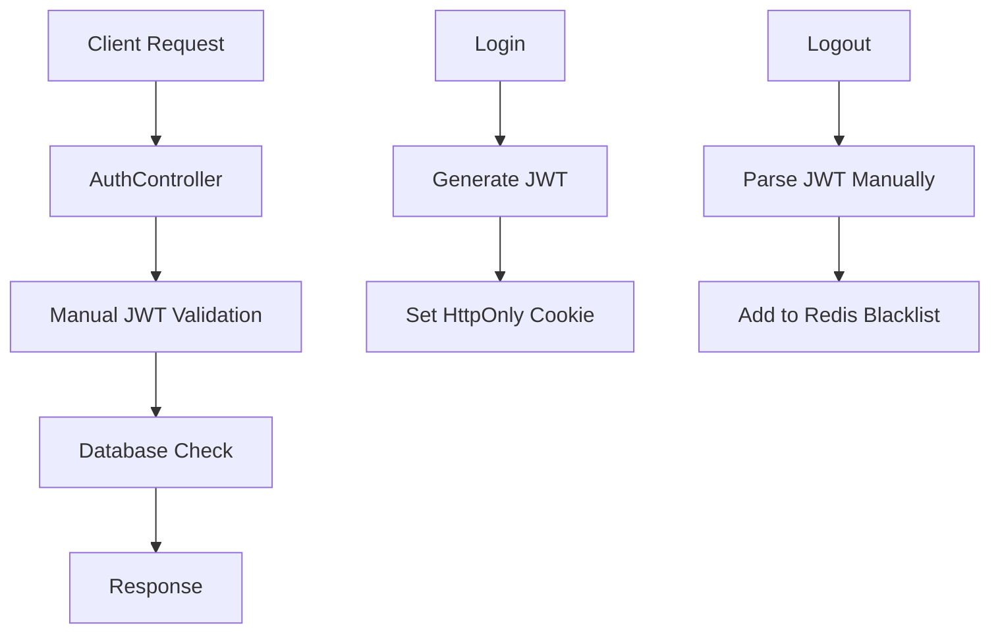
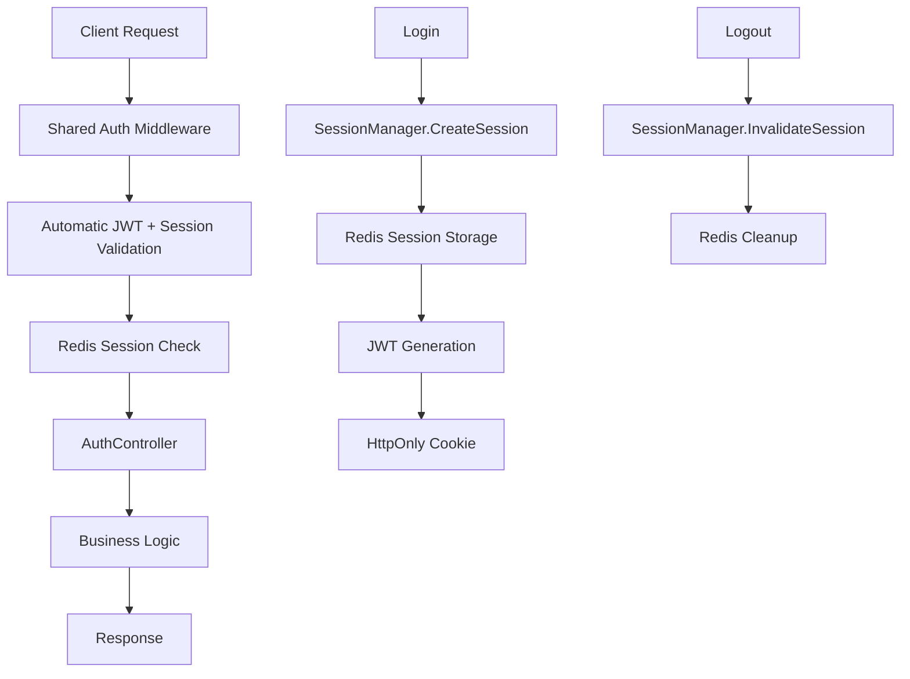

# ?? ???????? ? ?????????? JWT ?? Shared Authentication Library

## ?? ????? ????

??? ???????? ?????????? ?? ????????? AuthController ? ?????????? JWT management ?? shared authentication library ? Redis session management, ?????????? ??? ????? HttpOnly cookies ?? ?????????? ???????.

## ??? ???????????? ?????

### ?? ???? (???????? ??????)


### ? ????? (shared authentication)


## ?? ???????? ?????? ???????

### 1. **??????????? ?????????**
```csharp
// ????: ????? ????????? ? ??????? ??????
[HttpGet("me")]
[Authorize]
public async Task<ActionResult<UserInfo>> GetCurrentUser()
{
    string? token = null;
    if (Request.Cookies.TryGetValue("authToken", out var cookieToken))
    {
        token = cookieToken;
    }
    else if (Request.Headers.TryGetValue("Authorization", out var authHeader))
    {
        token = authHeader.ToString().Replace("Bearer ", "");
    }
    
    if (string.IsNullOrEmpty(token))
    {
        return Unauthorized(new { Message = "????? ?? ????????" });
    }
    
    var user = await _usersService.GetCurrentUserAsync(token);
    if (user == null)
    {
        return Unauthorized(new { Message = "?????????? ?????" });
    }
    // ... ????? ??????
}

// ?????: ??????????? ????????? ????? middleware
[HttpGet("me")]
[Authorize] // Shared middleware ??????????? ??????? ????? + ?????
public async Task<ActionResult<UserInfo>> GetCurrentUser()
{
    // JWT ??? ???????????, User.Identity ??????????
    var userId = User.FindFirst(ClaimTypes.NameIdentifier)?.Value;
    
    // ???????????: ????????? ????????? ?????
    var sessionId = User.FindFirst("session_id")?.Value;
    var sessionValidation = await _sessionManager.ValidateSessionByIdAsync(sessionId);
    
    // ... ?????? ??????-??????
}
```

### 2. **?????????????? ?????????? ???????**
```csharp
// ????: ??????????? ?????? ?? ?????? ???????
public async Task<IActionResult> Logout()
{
    // ??????? ?????? ???????? JWT
    var tokenHandler = new JwtSecurityTokenHandler();
    var jwt = tokenHandler.ReadJwtToken(token);
    var jti = jwt.Claims.FirstOrDefault(x => x.Type == JwtRegisteredClaimNames.Jti)?.Value;
    // ... ?????? ????
}

// ?????: ??????? ?????? shared service
public async Task<IActionResult> Logout()
{
    var sessionId = User.FindFirst("session_id")?.Value;
    await _sessionManager.InvalidateSessionAsync(sessionId);
    Response.Cookies.Delete("authToken");
    return Ok(new { Success = true });
}
```

### 3. **????????? ?????????? ?????**
```csharp
// ???? ??????????, ???? ?? ???? ??????:

// ???????? ???? ???????? ?????
[HttpGet("sessions")]
[Authorize]
public async Task<IActionResult> GetMySessions()
{
    var userId = Guid.Parse(User.FindFirst(ClaimTypes.NameIdentifier)!.Value);
    var sessions = await _sessionManager.GetUserSessionsAsync(userId);
    
    return Ok(sessions.Select(s => new {
        s.Id,
        s.DeviceId,
        s.IpAddress,
        s.CreatedAt,
        s.LastActivity,
        IsCurrent = s.Id.ToString() == User.FindFirst("session_id")?.Value
    }));
}

// ??????????? ?????????? ?????
[HttpPost("invalidate-session/{sessionId}")]
public async Task<IActionResult> InvalidateSession(string sessionId)
{
    await _sessionManager.InvalidateSessionAsync(sessionId);
    return Ok();
}

// ??????????? ??????????? ???? ????? ??? ????? ??????
[HttpPost("change-password")]
public async Task<IActionResult> ChangePassword([FromBody] ChangePasswordRequest request)
{
    var result = await _usersService.ChangePasswordAsync(userId, request.CurrentPassword, request.NewPassword);
    
    if (result.Success)
    {
        // ?? ???????: ??????????? ??? ?????
        await _sessionManager.InvalidateAllUserSessionsAsync(userId);
        Response.Cookies.Delete("authToken");
    }
    
    return Ok(result);
}
```

## ?? ???? ?? ?????? ????????

### ???? 1: ?????? shared library ?? ???????
```xml
<!-- UsersService.csproj -->
<ItemGroup>
  <ProjectReference Include="..\..\Shared\Marketplace.Authentication\Marketplace.Authentication.csproj" />
</ItemGroup>
```

### ???? 2: ??????????? ????????????
```json
// appsettings.json
{
  "Authentication": {
    "Jwt": {
      "SecretKey": "your-super-secret-key-32-chars-min",
      "Issuer": "Marketplace",
      "Audience": "MarketplaceClients",
      "AccessTokenExpiryMinutes": 15,
      "RefreshTokenExpiryDays": 7
    },
    "Redis": {
      "ConnectionString": "redis:6379",
      "KeyPrefix": "marketplace:auth:",
      "DefaultDatabaseIndex": 0
    },
    "Session": {
      "DefaultSessionDuration": "1.00:00:00",
      "RefreshThreshold": "00:30:00",
      "MaxConcurrentSessions": 5,
      "EnableSessionExtension": true
    }
  }
}
```

### ???? 3: ??????? Program.cs
```csharp
// ????
builder.Services.AddAuthentication(JwtBearerDefaults.AuthenticationScheme)
    .AddJwtBearer(options => {
        // ?????? ???? ????????????...
    });

// ?????
using Marketplace.Authentication.Extensions;
using Marketplace.Authentication.Middleware;

// ???? ????? ??????? ????????!
builder.Services.AddMarketplaceAuthentication(builder.Configuration, "users-service");

// ??????? middleware ??? ????????????? ????????? ??????????
app.UseAuthentication();
app.UseMiddleware<SessionActivityMiddleware>();
app.UseAuthorization();
```

### ???? 4: ??????? AuthController
```csharp
// ?????? DI
private readonly ISessionManager _sessionManager;

public AuthController(
    IUserService usersService, 
    IUserRepository userRepository,
    ISessionManager sessionManager, // ?? ????? ????????
    ILogger<AuthController> logger)

// ??????? Login ?????
[HttpPost("login")]
public async Task<ActionResult<AuthResponse>> Login([FromBody] LoginRequest request)
{
    var result = await _usersService.LoginAsync(request);
    
    if (result.Success && userEntity.State == "Active")
    {
        // ?? ????????? ????? ??????? ???????? JWT
        var sessionRequest = new CreateSessionRequest
        {
            UserId = userEntity.Id,
            UserEmail = userEntity.Email,
            UserName = userEntity.Name,
            Roles = userEntity.Roles ?? new List<string>(),
            DeviceId = "web-browser",
            IpAddress = Request.HttpContext.Connection.RemoteIpAddress?.ToString() ?? "",
            UserAgent = Request.Headers.UserAgent.ToString(),
            SessionDuration = TimeSpan.FromHours(24)
        };

        var sessionToken = await _sessionManager.CreateSessionAsync(sessionRequest);

        // HttpOnly cookie ?? ??????
        var cookieOptions = new CookieOptions
        {
            HttpOnly = true,
            Secure = Request.IsHttps,
            SameSite = SameSiteMode.Strict,
            Expires = sessionToken.AccessTokenExpiry,
            Path = "/"
        };
        Response.Cookies.Append("authToken", sessionToken.AccessToken, cookieOptions);

        // ?? ?? ?????????? ?????? ? ?????????
        result.Token = "stored_in_httponly_cookie";
        result.AccessToken = null;
    }
    
    return Ok(result);
}

// ????????? /me endpoint
[HttpGet("me")]
[Authorize] // ??????????? ?????????!
public async Task<ActionResult<UserInfo>> GetCurrentUser()
{
    var userId = User.FindFirst(ClaimTypes.NameIdentifier)?.Value;
    if (!Guid.TryParse(userId, out var userGuid))
    {
        return Unauthorized();
    }

    // ???????????: ????????? ????????? ?????
    var sessionId = User.FindFirst("session_id")?.Value;
    if (!string.IsNullOrEmpty(sessionId))
    {
        var sessionValidation = await _sessionManager.ValidateSessionByIdAsync(sessionId);
        if (!sessionValidation.IsValid)
        {
            Response.Cookies.Delete("authToken");
            return Unauthorized(new { Message = sessionValidation.ErrorMessage });
        }
    }

    // ????? ?????? ??????????? ???? ?
    var user = await _userRepository.GetByIdAsync(userGuid);
    // ...
}
```

## ?? ?????????? ?????????????

| ?????????????? | ???? (????????? JWT) | ????? (Shared Auth) |
|---------------|---------------------|-------------------|
| **?????????? ????????????** | ?? ?????? (100+ ?????? ????) | ?? ?????? (1 ?????) |
| **????????? ???????** | ?? ????? ? ??????? endpoint | ?? ??????????? ????? middleware |
| **?????????? ???????** | ?? ???????? | ?? ?????????? ????? Redis |
| **????????? ?????** | ?? ?????????? | ?? ???????? ????????? |
| **??????????? ???????** | ?? Blacklist ? Redis | ?? ??????????? ????? sessions |
| **Multi-device ?????????** | ?? ????? | ?? ????? ????????? |
| **????????? ?? ??????????** | ?? ?????? | ?? ???????? |
| **???????** | ?? HttpOnly cookies | ?? HttpOnly + session validation |
| **???????????????** | ?? ???????? | ?? Distributed ????? Redis |
| **??????????????** | ?? ??????? | ?? ?????? (????????? ? Redis) |

## ?? ?????????? ???????

### 1. **??????????? ??????????? ??? ?????????? ??????????**
```csharp
// Shared middleware ??????????? ?????????:
// - ?? ?? ???????? IP ?????? ?????
// - ?? ?? ?????????? ?????? ??? ?????
// - ?? ?? ?????????? ?????
// - ?? ???????? ?????????? ? ???????
```

### 2. **???????? ?????????? ?????**
```json
{
  "Session": {
    "MaxConcurrentSessions": 5  // ??????????? ??????? ????? ?????
  }
}
```

### 3. **??????????? ??????????? ?????**
```json
{
  "Session": {
    "EnableSessionExtension": true,
    "SessionExtensionThreshold": "00:15:00"  // ????????? ?? 15 ?? ?? ??????????
  }
}
```

## ?? ????????? ??????????

### 1. **???????? ????????? ?????**
```csharp
[HttpGet("analytics/sessions")]
[Authorize(Roles = "Admin")]
public async Task<IActionResult> GetSessionAnalytics()
{
    var allSessions = await _sessionManager.GetAllActiveSessionsAsync();
    
    return Ok(new {
        TotalActiveSessions = allSessions.Count,
        SessionsByDevice = allSessions.GroupBy(s => s.DeviceId).ToDictionary(g => g.Key, g => g.Count()),
        SessionsByHour = allSessions.GroupBy(s => s.CreatedAt.Hour).ToDictionary(g => g.Key, g => g.Count()),
        AverageSessionDuration = allSessions.Average(s => (DateTime.UtcNow - s.CreatedAt).TotalMinutes)
    });
}
```

### 2. **??????????????? ?????????? ???????**
```csharp
[HttpPost("admin/invalidate-user-sessions/{userId}")]
[Authorize(Roles = "Admin")]
public async Task<IActionResult> AdminInvalidateUserSessions(Guid userId)
{
    await _sessionManager.InvalidateAllUserSessionsAsync(userId);
    return Ok();
}

[HttpGet("admin/active-sessions")]
[Authorize(Roles = "Admin")]
public async Task<IActionResult> GetAllActiveSessions()
{
    var sessions = await _sessionManager.GetAllActiveSessionsAsync();
    return Ok(sessions);
}
```

### 3. **Background cleanup job**
```csharp
// Program.cs
builder.Services.AddHostedService<SessionCleanupService>();

public class SessionCleanupService : BackgroundService
{
    protected override async Task ExecuteAsync(CancellationToken stoppingToken)
    {
        while (!stoppingToken.IsCancellationRequested)
        {
            await _sessionManager.CleanupExpiredSessionsAsync(stoppingToken);
            await Task.Delay(TimeSpan.FromHours(1), stoppingToken);
        }
    }
}
```

## ?? ?????????? ????????

### 1. **Unit tests**
```csharp
[Test]
public async Task Login_WithValidCredentials_CreatesSessionInRedis()
{
    // Arrange
    var controller = new AuthController(_userService, _userRepository, _sessionManager, _logger);
    var request = new LoginRequest { Email = "test@example.com", Password = "password" };

    // Act
    var result = await controller.Login(request);

    // Assert
    var okResult = result.Result as OkObjectResult;
    var response = okResult.Value as AuthResponse;
    
    Assert.That(response.Success, Is.True);
    Assert.That(response.Token, Is.EqualTo("stored_in_httponly_cookie"));
    
    // Verify session was created in Redis
    var sessions = await _sessionManager.GetUserSessionsAsync(testUserId);
    Assert.That(sessions.Count, Is.EqualTo(1));
}
```

### 2. **Integration tests**
```csharp
[Test]
public async Task GetCurrentUser_WithValidSession_ReturnsUserInfo()
{
    // Arrange: Create session
    var sessionToken = await _sessionManager.CreateSessionAsync(new CreateSessionRequest 
    { 
        UserId = testUserId,
        UserEmail = "test@example.com"
    });

    var client = _factory.CreateClient();
    client.DefaultRequestHeaders.Add("Cookie", $"authToken={sessionToken.AccessToken}");

    // Act
    var response = await client.GetAsync("/api/auth/me");

    // Assert
    Assert.That(response.StatusCode, Is.EqualTo(HttpStatusCode.OK));
    var userInfo = await response.Content.ReadFromJsonAsync<UserInfo>();
    Assert.That(userInfo.Email, Is.EqualTo("test@example.com"));
}
```

## ? ??????? ????????

- [ ] ?????? shared authentication library ?? ???????
- [ ] ??????????? Redis connection string
- [ ] ??????? ???????????? ? appsettings.json
- [ ] ???????? `builder.Services.AddAuthentication()` ?? `builder.Services.AddMarketplaceAuthentication()`
- [ ] ?????? `ISessionManager` ?? AuthController constructor
- [ ] ??????? Login ????? ??? ????????? ?????
- [ ] ????????? /me endpoint (???????? ????? ?????????)
- [ ] ??????? Logout ??? ???????????? session manager
- [ ] ?????? ???? endpoints ??? ?????????? ???????
- [ ] ???????? unit ?? integration ?????
- [ ] ???????? ??????????????? ??????????
- [ ] ?????????? ?? staging ?? ????????????
- [ ] ??????????? rollback ????

## ?? ?????????

????? ???????? ?? ?????????:

? **??? ????? ?????????**: ??????? ?????? ?????? JWT logic - ???? ????? ????????????  
? **??????? ???????????**: ??????????? ?????????? ??????? + Redis validation  
? **???????????????**: Distributed sessions ??? multi-instance deployment  
? **??????????**: ???????? ????????? ???? ????? ????????????  
? **?????????**: ???? ?????????? ?? multi-device sessions, automatic refresh  
? **??????????????**: Redis ????????? ??????? ????????? JWT ?????????  

?? ?????????? ? ???????? ???????????, ??? ????????? ????????????! ??